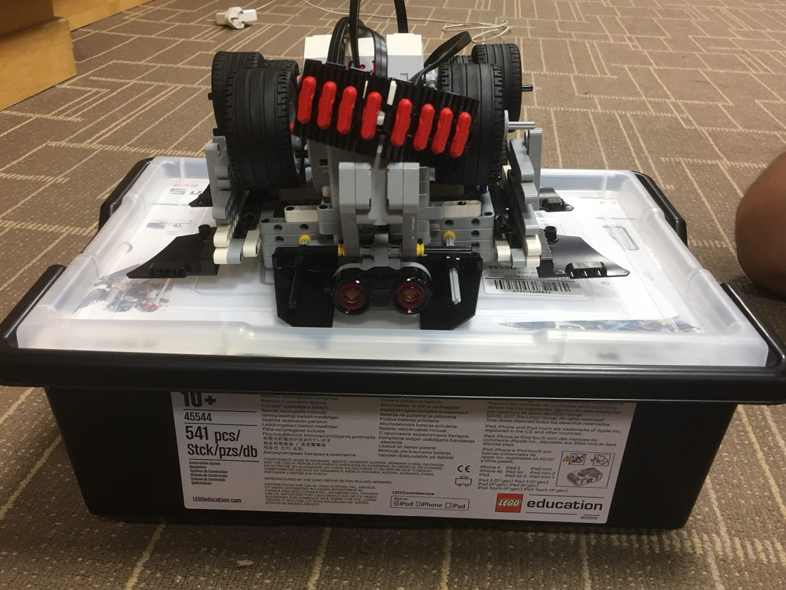

# SumoBot

Sumobot is a sport in which two robots attempt to push each other out of a circle (from wiki). My team and I took part in this intra school Sumobot competition and achieved 3rd/4th placing :).  
Here's a picture of our robot!  

(P.S. that's its championship belt.)

Here's a [link](https://photos.google.com/share/AF1QipN3Tve0Ix9-0DdKPMrvVjP3PE_MZCFbupeB6kJO78tFVs-S-5gLRB1nqUL08iCGvg?key=RFBVU1htMWJNU0FfX1VpTU02VVZtUElGdko4V19R) to our semifinals video.
